# Site Reliability Engineering (SRE) & OCI Architecture

## Day 1: SRE Foundations, Culture & Toil

### 1. Identity
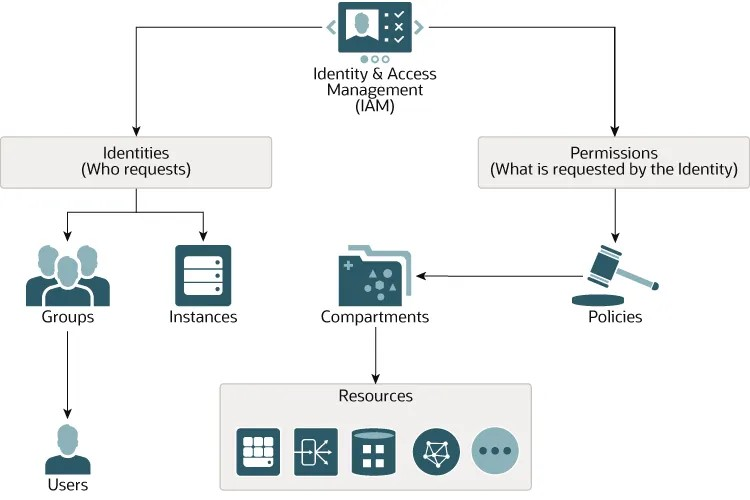

#### Core Concept
Identity & Access Management (IAM) Structure in OCI.

#### Detailed Explanation
This diagram introduces the fundamental security model of our cloud platform (OCI). It shows how **Identities** (Users, Groups, and even Instances) interact with **Resources**. The critical bridge between them is **Permissions** (defined by Policies). Note the "Compartments" box; this is a logical container unique to OCI used to isolate resources. This structure ensures that only authorized entities can access specific compute, database, or network resources.

#### Real-World Example
A new developer joins the team. You add them to the "Developers" Group. The Policy says "Developers can manage Instances in the Dev Compartment." They instantly get access without you touching the servers.

### 2. SRE Hierarchy of Needs
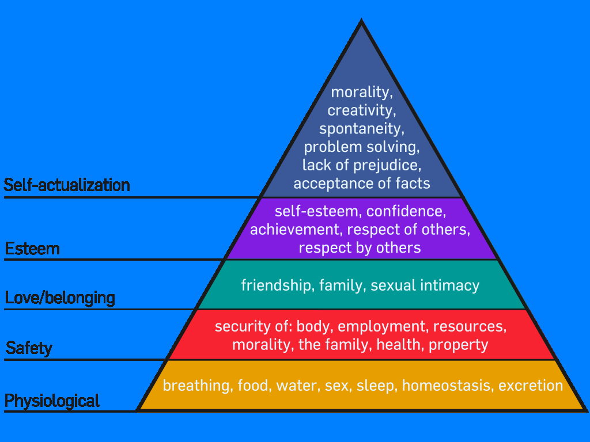

#### Core Concept
The Service Reliability Hierarchy.

#### Detailed Explanation
Modeled after Maslow’s Hierarchy of Needs, this pyramid dictates that you cannot build advanced systems without basic foundations.
- **Monitoring (Bottom):** If you can't see it, you can't fix it.
- **Incident Response:** When things break, how do you react?
- **Postmortem:** Learning from failure.
- **Testing:** Preventing failure before production.
- **Capacity Planning:** Ensuring future scale.
- **Product (Top):** Only when the system is reliable can you focus on features.

| Pyramid Level | SRE Activity | The "Need" (Analogy) | Practical Example |
| :--- | :--- | :--- | :--- |
| **6. Product** (Top) | **Feature Development** | **Self-Actualization** (delivering value) | Launching a new "One-Click Checkout" feature for users. |
| **5. Capacity** | **Scalability Planning** | **Esteem** (confidence in future) | Simulating 5x traffic to ensure servers survive a Black Friday sale. |
| **4. Testing** | **CI/CD & QA** | **Belonging** (fitting into the system) | An automated pipeline blocking a deployment because a unit test failed. |
| **3. Postmortem** | **Root Cause Analysis** | **Safety** (future prevention) | Writing a report to change a process so the database never crashes this way again. |
| **2. Incident Response** | **On-Call & Runbooks** | **Safety** (immediate survival) | PagerDuty waking an engineer at 2 AM to restart a stuck service. |
| **1. Monitoring** (Base) | **Observability** | **Physiological** (basic awareness) | A dashboard showing `HTTP 500` error rates so you know the site is down. |

### 3. DevOps vs. SRE (Venn Diagram)
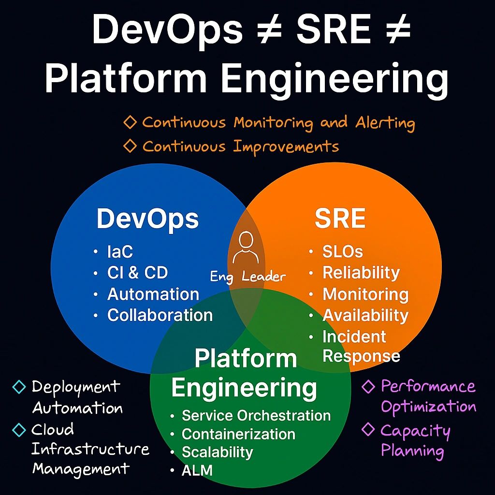

Here is the enhanced content, keeping it concise while clearly distinguishing the three roles.

### Core Concept
**The Engineering Triad: Speed vs. Stability vs. Efficiency.**
Understanding how DevOps, SRE, and Platform Engineering differ yet work together.

### Detailed Explanation
* **DevOps:** Focuses on the **"Pipeline"**. It builds the culture and tools (CI/CD, IaC) that allow code to move from development to production efficiently.
* **SRE (Site Reliability Engineering):** Focuses on **"Production Health"**. They treat operations as a software problem, using SLOs (Service Level Objectives) and Error Budgets to ensure the system stays online.
* **Platform Engineering:** Focuses on the **"Developer Experience"**. They build an Internal Developer Platform (IDP) to provide "Self-Service" capabilities. Their goal is to remove friction so developers can code without fighting the infrastructure.

### Comparison Table

| Role | Primary Customer | Key Focus | The "Product" They Build |
| :--- | :--- | :--- | :--- |
| **DevOps** | The Release Process | Delivery Speed & Automation | CI/CD Pipelines & Config Management |
| **SRE** | The End User | Reliability & Availability | Monitoring, Alerting & Auto-scaling |
| **Platform** | The Developer | Efficiency & Self-Service | The Internal Developer Platform (IDP) |

### Real-World Example (The Flow)
1.  **The Platform Engineer** builds a "Create Microservice" button in the internal portal (IDP) so developers don't have to configure AWS manually.
2.  **The DevOps Engineer** ensures that when the developer clicks that button, a standardized Jenkins pipeline automatically builds and deploys the code.
3.  **The SRE** ensures that once the application is running, it doesn't crash, and sets up alerts if latency exceeds 200ms.

### 4. Role Comparisons (Detailed)

#### Core Concept
Specific responsibilities for Engineering roles.

#### Detailed Explanation
* **SRE:** Owns Availability, Reliability, and Capacity Planning.
* **Platform Engineer:** Owns the internal tools (Service Orchestration, Containerization) that developers use.
* **DevOps:** Owns the release mechanics (CI/CD).

### 5. SRE Maturity Model
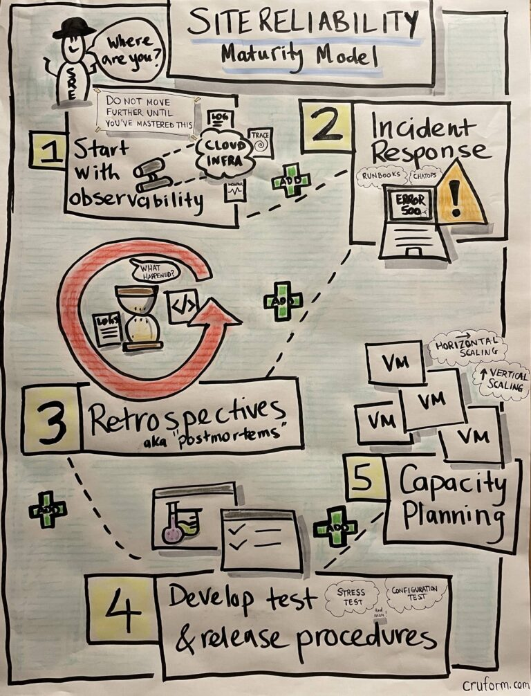
Here is the concise version.

### Core Concept
**SRE is a Journey.** You cannot jump straight to Google-level maturity. You must build layer by layer.

### The 5 Stages of SRE Evolution

1.  **Observability (The Eyes)**
    * *From:* Guessing what is wrong.
    * *To:* **Knowing** what is wrong using Dashboards and Metrics.
    * *Example:* Installing Prometheus to see CPU spikes instead of waiting for user complaints.

2.  **Incident Response (The Firefighter)**
    * *From:* Panic and calling the "smartest person."
    * *To:* **Runbooks** and clear processes.
    * *Example:* Following a step-by-step checklist to restart a server in 5 minutes.

3.  **Post-Mortems (The Scientist)**
    * *From:* Blaming people for mistakes.
    * *To:* **Fixing processes** so it never happens again.
    * *Example:* "We need a backup check in the script" instead of "Steve shouldn't have clicked that."

4.  **Automation (The Engineer)**
    * *From:* Manual, repetitive tasks (Toil).
    * *To:* **Automated pipelines** (CI/CD).
    * *Example:* A script deploys code automatically and stops if it detects errors.

5.  **Capacity Planning (The Architect)**
    * *From:* Reacting after the server crashes.
    * *To:* **Proactive scaling** before the traffic hits.
    * *Example:* Auto-scaling adds 10 servers automatically because it predicts high load.

### 6. Observability: The Three Pillars
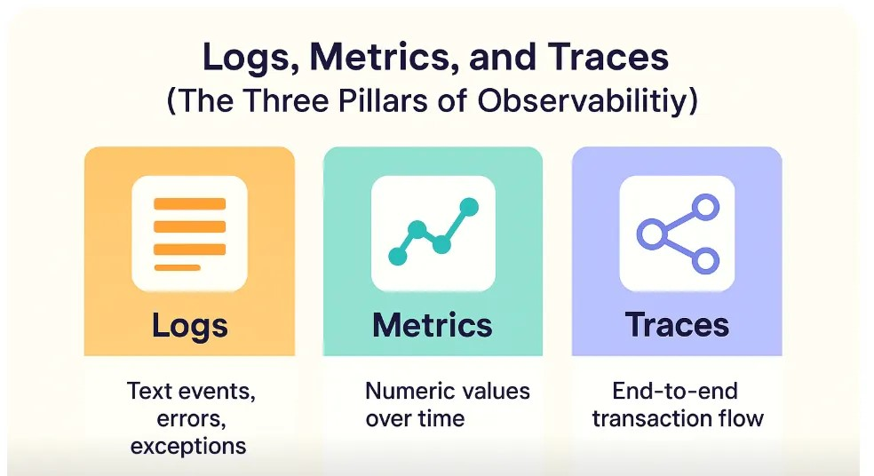

#### Core Concept
The three types of data needed to understand a system: Logs, Metrics, and Traces.

#### Detailed Explanation
* **Logs:** "What happened?" (Detailed text events, errors).
* **Metrics:** "Is it healthy?" (Numbers, counts, gauges over time).
* **Traces:** "Where did it happen?" (The journey of a request across microservices).

### 7. Observability Deep Dive
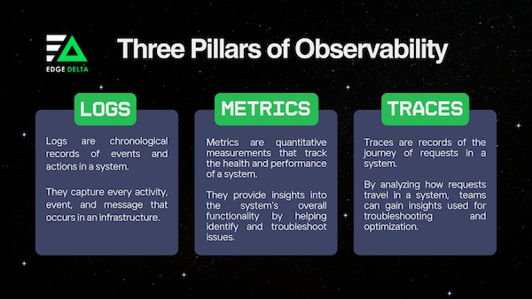

### The Three Pillars of Observability

**Core Concept**
To truly understand a distributed system, you need three specific types of data: **Numbers** (Metrics), **Text** (Logs), and **Context** (Traces).

**Detailed Explanation**

1.  **Metrics ("Is it healthy?")**
    * *What:* Aggregated numbers measured over time. Low storage cost, fast to query.
    * *Example:* `CPU_Usage = 90%` or `Requests_Per_Second = 500`.
    * *Use Case:* Detecting a problem (Alerting).

2.  **Logs ("What happened?")**
    * *What:* A timestamped record of a discrete event. High detail, high storage cost.
    * *Example:* `2023-10-27 10:00:01 ERROR: Database connection failed - password incorrect.`
    * *Use Case:* Debugging the specific error details.

3.  **Traces ("Where did it happen?")**
    * *What:* The journey of a single user request as it hops between different microservices.
    * *Example:* User $\rightarrow$ Load Balancer $\rightarrow$ *Auth Service (2ms)* $\rightarrow$ *Billing Service (5000ms)*.
    * *Use Case:* Finding bottlenecks in a complex chain.

---

### Observability Deep Dive (How they interact)

**Core Concept**
No single pillar is enough. You need all three to solve the mystery of "Why is the system broken?"

**Detailed Explanation: A Real-World Debugging Flow**
Imagine a user complains that "Checkout is slow."

1.  **Start with Metrics:** The dashboard shows a spike.
    * *Insight:* "Yes, `Checkout_Latency` has jumped from 200ms to 5 seconds." (Confirming the issue).
2.  **Move to Traces:** Look at a slow request to see where the time is going.
    * *Insight:* The `Frontend` is fast, the `Inventory` is fast, but the `Payment Service` is taking 4.8 seconds. (Isolating the location).
3.  **Finish with Logs:** Check the logs specifically for the `Payment Service`.
    * *Insight:* "Error: Connection timeout to external Banking API." (Finding the Root Cause).

**Summary:**
* **Metrics** tell you **when** to look.
* **Traces** tell you **where** to look.
* **Logs** tell you **what** you are looking at.

### 8. Incident Response Lifecycle
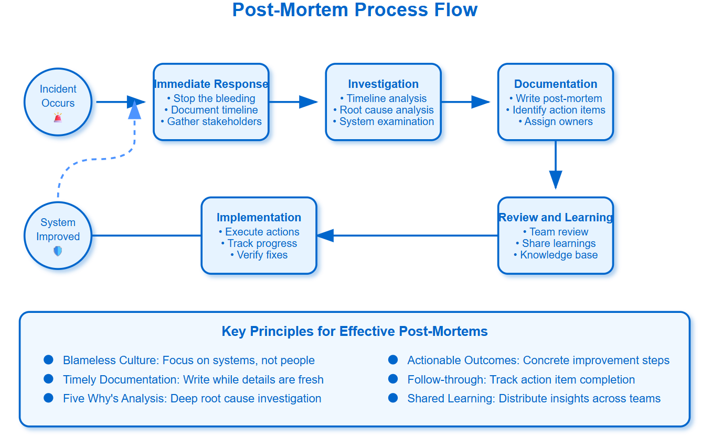

#### Core Concept
The structured "Lifecycle" of handling an outage.

#### Detailed Explanation
1.  **Incident Occurs:** The alarm fires.
2.  **Immediate Response:** "Stop the bleeding." Fix the issue first; find the root cause later.
3.  **Investigation:** Deep dive into why it happened.
4.  **Documentation:** Write the Post-Mortem.
5.  **System Improved:** Implement fixes to ensure it never happens again.

### 9. Blameless Post-Mortems

#### Core Concept
Shifting from "Who broke it?" to "How do we fix the system?"

#### Detailed Explanation
* **Blame Culture:** Uses "You" statements. Focuses on punishment. Result: People hide mistakes.
* **Ownership Culture:** Uses "System" statements. Focuses on improvement. Result: People report mistakes early.

#### Real-World Example
An intern deletes a production database.
* *Blame:* Fire the intern.
* *Ownership:* Ask "Why did the system allow an intern to delete a database without approval?" and add a safeguard.

### 10. Defining Toil
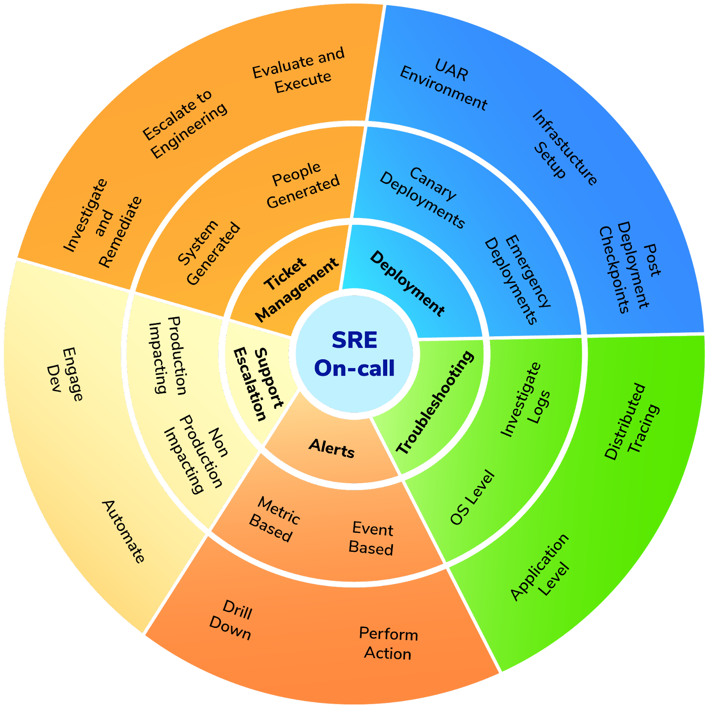

#### Core Concept
Work that makes you feel like a robot.

#### Detailed Explanation
Toil is defined as work that is **Manual**, **Repetitive**, **Automatable**, and **Tactical** (devoid of long-term value). If you are SSH-ing into servers to restart them every day, that is Toil.

### 11. The SRE Ecosystem
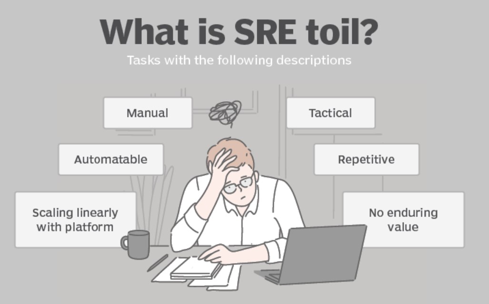

#### Core Concept
Where SREs spend their time.

#### Detailed Explanation
Toil often hides in the inner circles: "Ticket Management" and "Alerts". The goal of SRE is to move from these inner circles (manual response) to the outer circles (Automation, Drill Down, and Engineering).

### 12. The Automation Reality

#### Core Concept
The Automation Paradox.

#### Detailed Explanation
In theory, automation frees up time. In reality, writing and maintaining the automation script is work in itself. **Lesson:** Only automate tasks that happen frequently enough to justify the development cost.

### 13. Automation Decision Tree
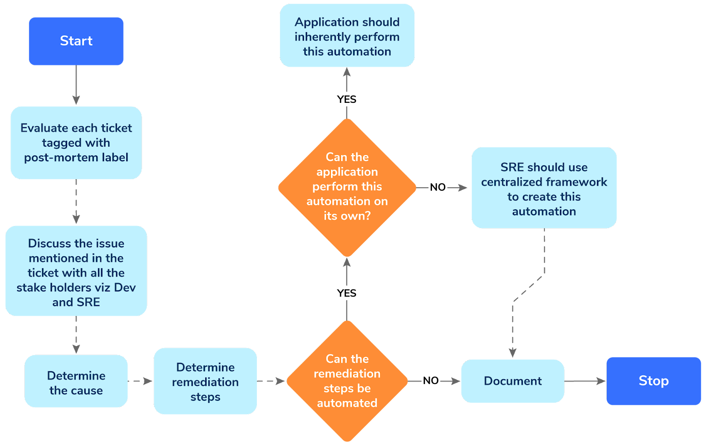

#### Core Concept
A flowchart for deciding when to automate.

#### Detailed Explanation
Follow this logic:
1.  Is it a frequent ticket?
2.  Can the application fix itself? (Self-healing).
3.  If not, can SRE scripts fix it?
4.  If yes -> Automate. If no -> Document the manual fix.

### 14. Cost of Quality (Shift Left)
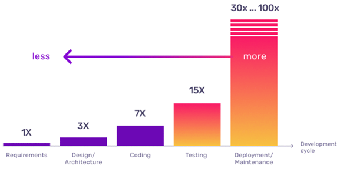

#### Core Concept
It gets expensive to fix problems the longer you wait.

#### Detailed Explanation
* **Requirements Phase (1x):** Fixing a misunderstanding on a whiteboard is free.
* **Testing Phase (15x):** Fixing a bug found by QA takes developer hours.
* **Deployment Phase (100x):** Fixing a bug in production means downtime, lost revenue, and angry customers.

### 15. CI/CD Pipeline Anatomy
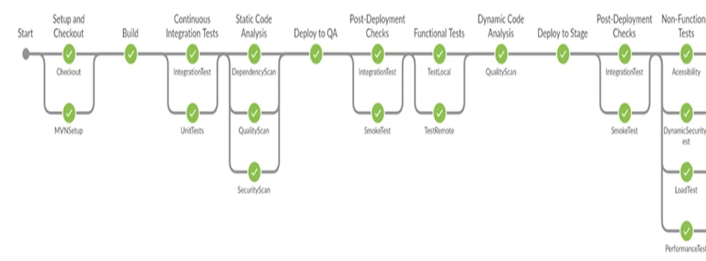

#### Core Concept
The automated delivery chain.

#### Detailed Explanation
A robust pipeline includes Unit Tests -> Static Code Analysis -> Deployment to QA -> Functional Tests -> Deployment to Stage. Reliability checks (like Quality Gates) must exist at *every* step.

### 16. Quality Gates & Canary
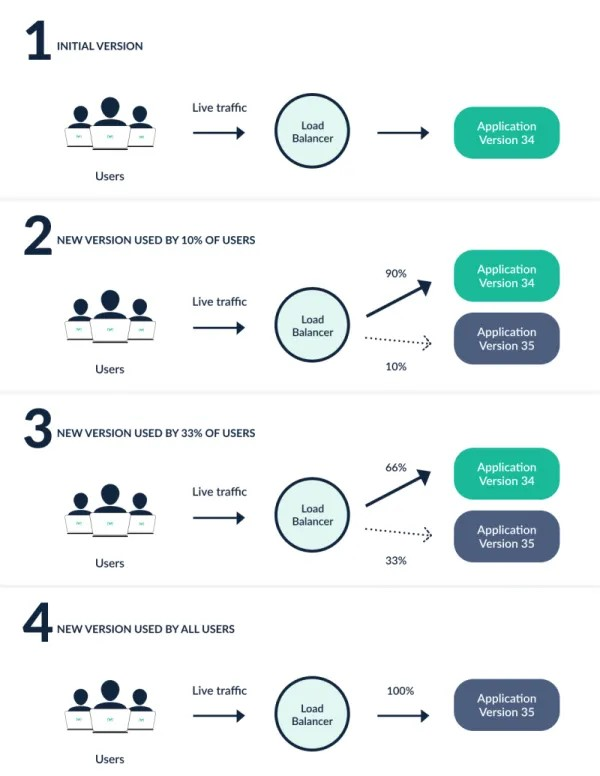

#### Core Concept
Safe Deployment Strategy.

#### Detailed Explanation
Never deploy to 100% of users at once.
1.  Deploy to 10% (Canary).
2.  Check metrics (Quality Gate).
3.  Scale to 33%.
4.  Scale to 100%.

---

## Day 2: Service Level Objectives & Monitoring

### 17. SLI, SLO, SLA Icons
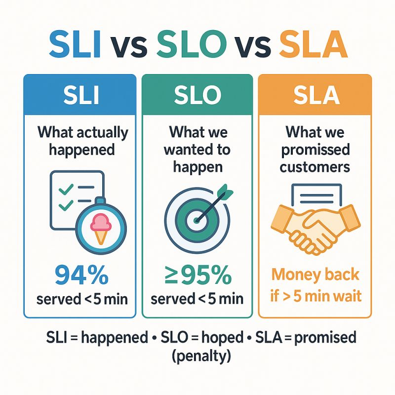

#### Core Concept
Quick visual definitions.
* **SLI:** What actually happened (94%).
* **SLO:** What we wanted to happen (95%).
* **SLA:** What we promised/penalty (Money back if < 90%).

### 18. The Happiness Gap
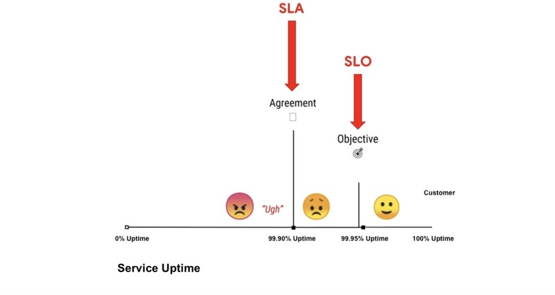

#### Core Concept
Operating between "Happy" and "Angry".

#### Detailed Explanation
Your internal goal (SLO) must be stricter than your external promise (SLA). The gap between the SLA (99.90%) and the SLO (99.95%) is your safety buffer. If you hit the SLA, you have already failed your customer significantly.

### 19. The Error Budget Formula

#### Core Concept
Reliability is not 100%.

#### Detailed Explanation
**Formula:** `Error Budget = 100% - SLO`
This budget is an asset. You can "spend" it on risky deployments or experiments. If you don't spend your error budget, you might be moving too slowly (too conservative).

### 20. SLO Reliability Curve
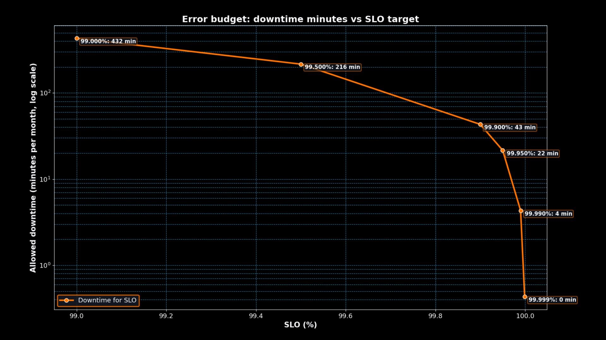

#### Core Concept
The exponential cost of "nines".

#### Detailed Explanation
Notice the drop. 99.0% allows 432 minutes of downtime/month. 99.99% allows only 4 minutes. Every additional "nine" costs significantly more money and effort.

### 21. Burn Rate Formula

#### Core Concept
How fast are we crashing?

#### Detailed Explanation
**Formula:** `Burn Rate = Error Consumed / Error Allowed`
* Rate = 1 means you are consuming budget exactly as planned.
* Rate > 1 means you are burning too fast (Alert!).

### 22. Burn Rate Slopes
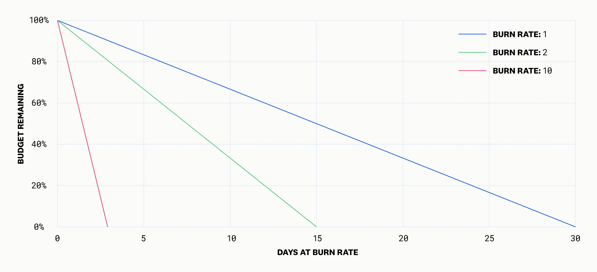

#### Core Concept
Visualizing budget consumption.

#### Detailed Explanation
The red line (Rate 10) shows the budget hitting 0% in just 3 days. The blue line (Rate 1) lasts the full 30 days. This helps you visualize urgency.

### 23. Error Budget Balance
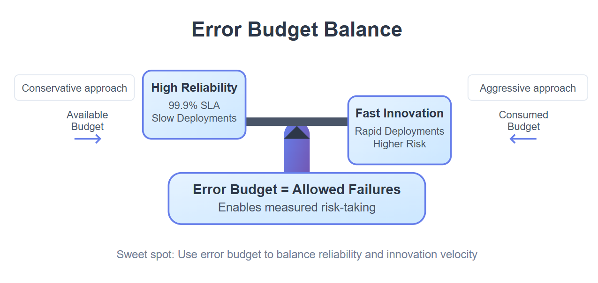

#### Core Concept
The negotiation between SREs and Developers.

#### Detailed Explanation
* **Left Side (High Reliability):** Slow deployments, stable system. Use this when budget is empty.
* **Right Side (Fast Innovation):** Rapid deployments, higher risk. Use this when budget is full.

### 24. Latency Histogram
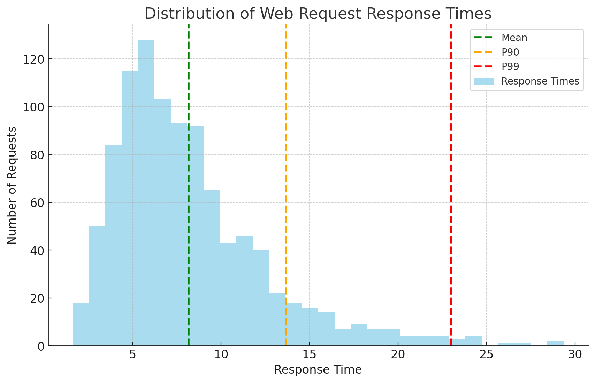

#### Core Concept
Why Averages Fail.

#### Detailed Explanation
The Green line (Mean) looks fine. But the Red line (P99) is far to the right. This means 1% of your users are having a terrible experience (23 seconds latency), even if the "Average" user is fine. SREs must monitor the tail (P99).

### 25. The Golden Signals
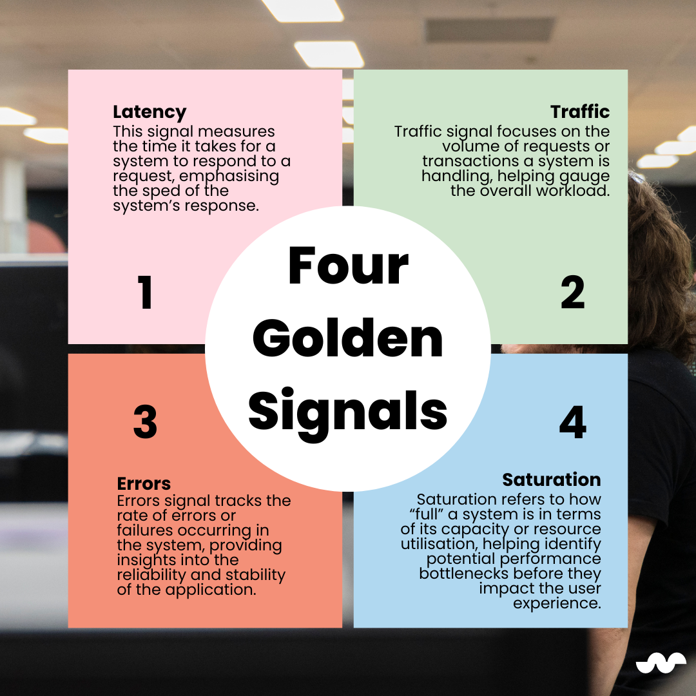

#### Core Concept
Google's standard for monitoring.

#### Detailed Explanation
1.  **Latency:** Time taken to serve a request.
2.  **Traffic:** Demand on the system (req/sec).
3.  **Errors:** Rate of requests failing.
4.  **Saturation:** How "full" is the system (CPU/Memory/Disk).

### 26. Blackbox vs. Whitebox Monitoring
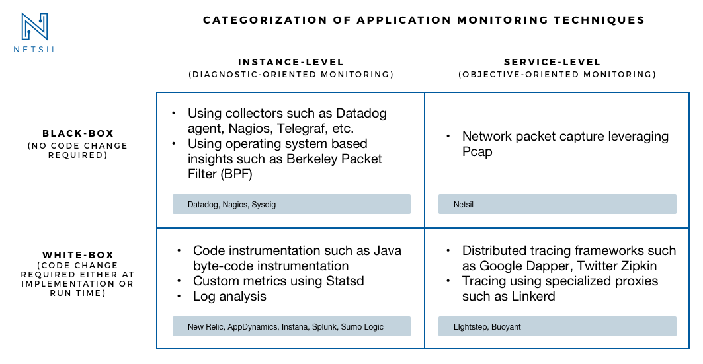

#### Core Concept
Outside-in vs. Inside-out views.

#### Detailed Explanation
* **Black-box:** Tests "Does it work?" Checks symptom. (e.g., Pinging the homepage).
* **White-box:** Tests "Why is it breaking?" Checks cause. (e.g., Checking if the Java Heap is full).

---

## Day 3: Reliability Architecture & Patterns

### 27. SRE Capacity Planning
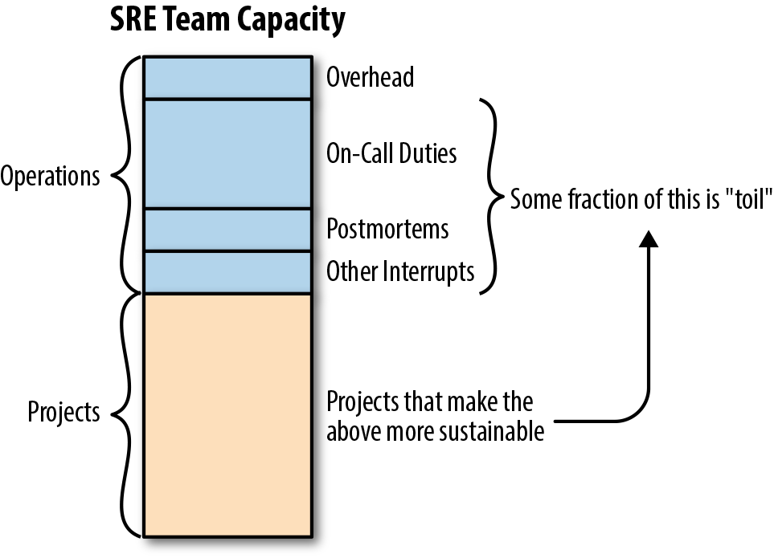

#### Core Concept
The 50/50 Rule.

#### Detailed Explanation
An SRE team should spend max 50% of time on "Ops/Toil" (Blue). The remaining 50% MUST be spent on "Projects" (Orange) to improve the system and reduce future toil.

### 28. Incident Response Workflow
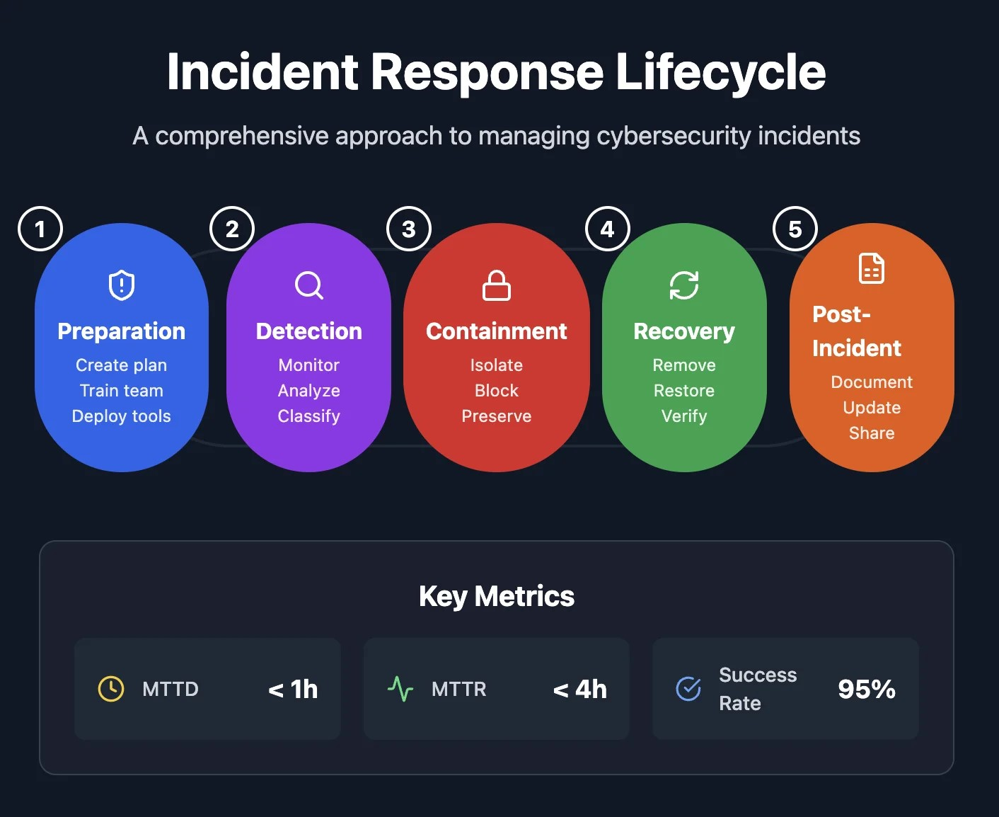

#### Core Concept
The Cycle of Response.

#### Detailed Explanation
1.  Preparation (Training)
2.  Detection (Monitoring)
3.  Containment (Isolate the issue)
4.  Recovery (Restore service)
5.  Post-Incident (Learn)

### 29. RTO vs RPO

#### Core Concept
Defining "Disaster".

#### Detailed Explanation
* **RPO (Recovery Point Objective):** How much *data* can you afford to lose? (Time since last backup).
* **RTO (Recovery Time Objective):** How much *time* can you be offline? (Time until system is back up).

### 30. Load Balancing (Round Robin)
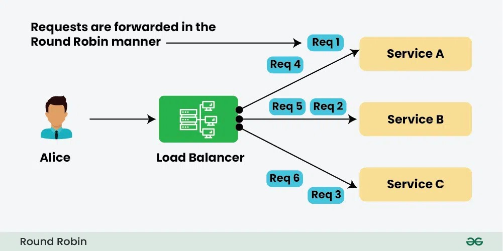

#### Core Concept
Simple Traffic Distribution.

#### Detailed Explanation
Requests are dealt like a deck of cards: 1 to A, 2 to B, 3 to C. Good for simple setups, bad if one server is faster than others.

### 31. Active-Active Architecture
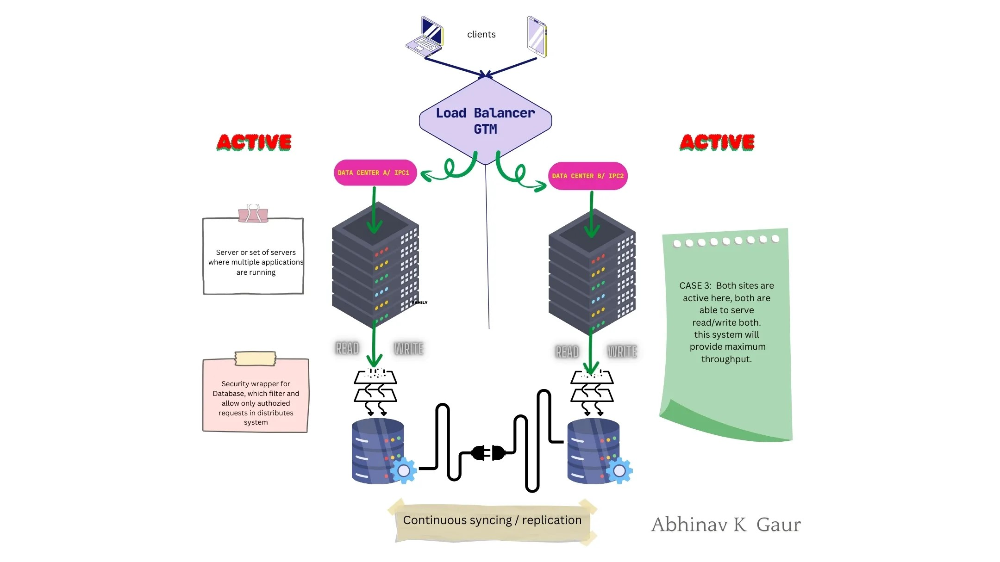

#### Core Concept
High Availability Design.

#### Detailed Explanation
Diagram showing a Global Traffic Manager (GTM) distributing traffic between two active Data Centers. Both are reading/writing to DBs with replication. This provides maximum throughput and redundancy.

### 32. Circuit Breaker Pattern

#### Core Concept
Stopping a failure from cascading.

#### Detailed Explanation
* **Closed:** Normal operation. Traffic flows.
* **Open:** Error threshold reached. Traffic is blocked to allow the service to recover.
* **Half-Open:** Sending a few test requests to see if the service is back online.

### 33. Swiss Cheese Model
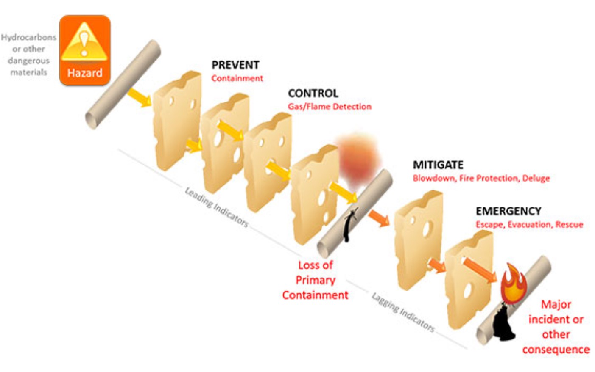

#### Core Concept
Defense in Depth.

#### Detailed Explanation
No single layer is perfect (they all have holes). By layering defenses (Prevention, Detection, Mitigation, Emergency Response), we ensure that a threat cannot pass through all holes to cause a major incident.

### 34. Canary Deployment
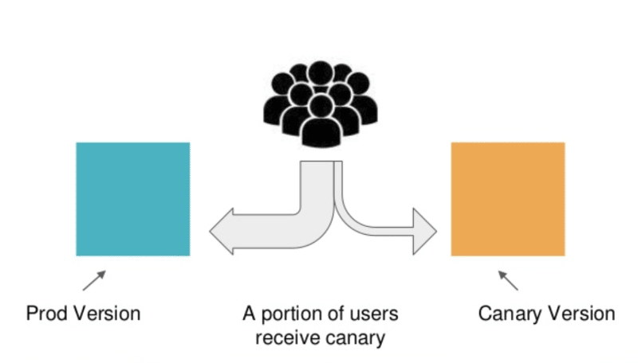

#### Core Concept
Limiting the blast radius.

#### Detailed Explanation
Don't deploy to everyone at once. Send the new version (Orange) to a small subset of users (the "Canary"). If the Canary dies, only a few users are affected.

### 35. Terraform Lifecycle

#### Core Concept
Infrastructure as Code (IaC) workflow.

#### Detailed Explanation
* `init`: Initialize provider.
* `plan`: Preview changes (Dry run).
* `apply`: Create resources.
* `destroy`: Tear down.

### 36. ELK Stack Workflow
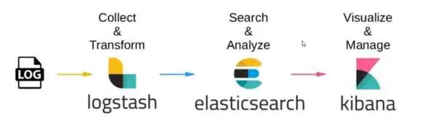

#### Core Concept
Logging Pipeline.

#### Detailed Explanation
* **Logstash:** Collects and transforms logs.
* **Elasticsearch:** Stores and indexes data.
* **Kibana:** Visualizes data (Dashboards).

---

## Day 4: OCI Cloud Infrastructure

### 37. OCI Global Hierarchy

#### Core Concept
Physical Isolation Hierarchy.

#### Detailed Explanation
* **Region:** A geographic area (e.g., Ashburn, Mumbai).
* **Availability Domain (AD):** Isolated Data Centers within a Region.
* **Fault Domain (FD):** Isolated racks/hardware within an AD.

### 38. VCN Architecture
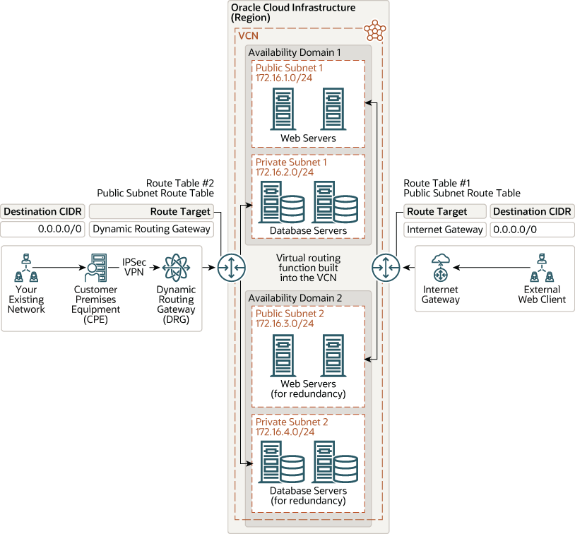

#### Core Concept
Virtual Cloud Network (VCN).

#### Detailed Explanation
* **Public Subnet:** Has Internet Gateway (IGW). Web Servers go here.
* **Private Subnet:** No direct internet access. Databases go here.
* **Security:** This separation prevents hackers from attacking your database directly.

### 39. Active-Active vs. Active-Passive
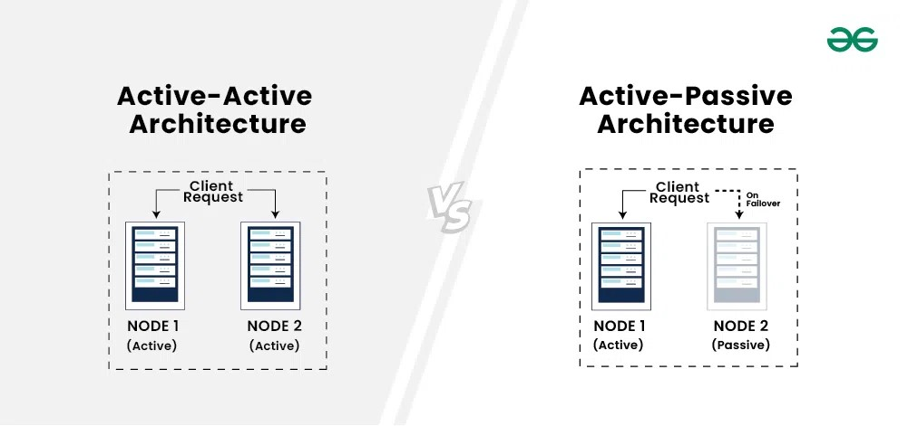

#### Core Concept
High Availability Architectures.

#### Detailed Explanation
* **Active-Passive:** One server works, one sleeps (Backup). Cheaper, but failover takes time.
* **Active-Active:** Both servers work. If one fails, the other takes the full load instantly. More expensive, harder to sync data.

### 40. Disaster Recovery Timeline
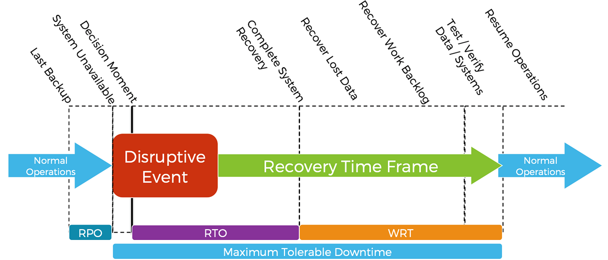

#### Core Concept
The total cost of downtime.

#### Detailed Explanation
Shows that **MTD (Maximum Tolerable Downtime)** is the sum of RTO (System recovery) + WRT (Work Recovery / verifying data).

---

## Day 5: OCI Governance & Security

### 41. OCI Compartments
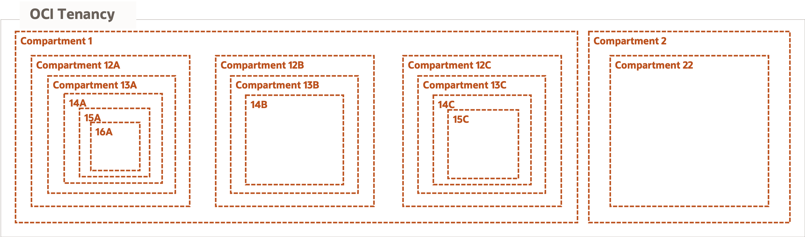

#### Core Concept
Logical Isolation.

#### Detailed Explanation
Compartments organize resources (like folders on a PC). They can be nested (Parent Compartment -> Child Compartment). Policies are attached to compartments to control access.

### 42. Alarm Management Lifecycle
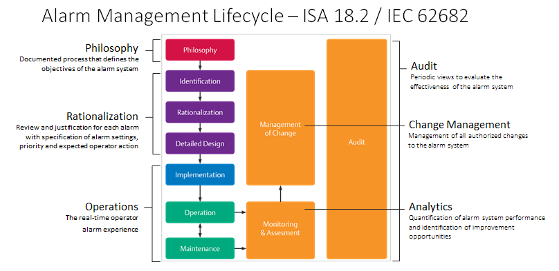

#### Core Concept
ISA 18.2 Standard.

#### Detailed Explanation
Managing alarms is a lifecycle, not a one-time setup. It involves Philosophy -> Identification -> Rationalization -> Design -> Implementation -> Operations -> Maintenance -> Audit.

### 43. OCI Security Architecture (Vault & IAM)
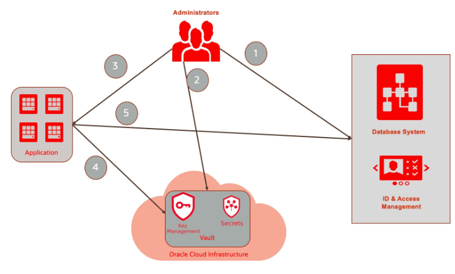

#### Core Concept
Managing Secrets securely.

#### Detailed Explanation
Diagram showing how an Application retrieves credentials. Instead of hardcoding passwords, the app talks to **OCI Vault**, which securely retrieves the **Secret**, authenticated via **IAM**.